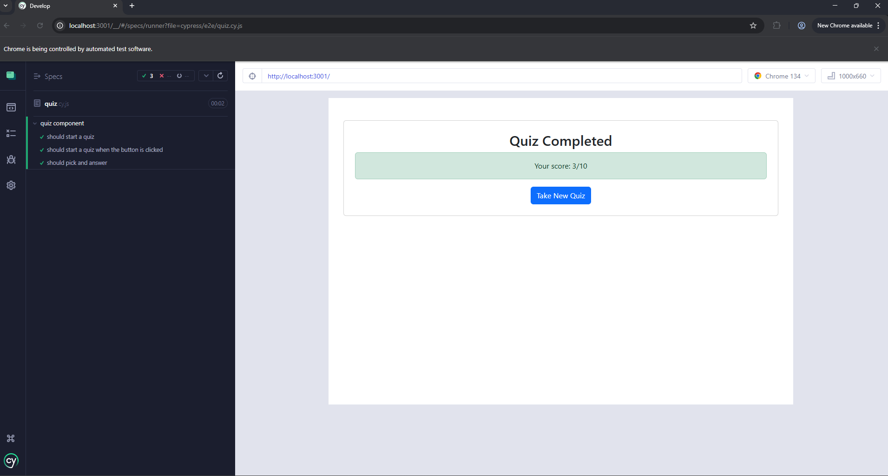

# Techtest
# Tech Quiz Application

## Table of Contents
- [Description](#description)
- [Features](#features)
- [Technologies Used](#technologies-used)
- [Installation](#installation)
- [Usage](#usage)
- [Testing with Cypress](#testing-with-cypress)
- [Screenshots](#screenshots)
- [Walkthrough Video](#Walkthrough-Video)
- [Contact](#contact)

---

## Description
The **Tech Quiz Application** is an interactive web-based quiz that allows users to test their tech knowledge by answering multiple-choice questions. The application provides real-time feedback and calculates the final score at the end of the quiz. The project also includes automated testing using **Cypress** to ensure functionality and user experience.

---

## Features

### 🎯 Quiz Functionality
- Users can **start the quiz** by clicking the start button.
- Users are presented with a **series of questions**.
- After answering a question, the **next question is displayed**.
- Once all questions are answered, the **quiz ends**, and the user can see their final **score**.
- Users have the option to **restart the quiz** and try again.

### 🛠️ Automated Testing with Cypress
- **End-to-End testing** ensures smooth user interactions.
- **Functional tests** check quiz progression and scoring.
- **UI tests** verify elements are correctly displayed and interactive.
- **Regression testing** ensures updates do not break existing features.

---

## Technologies Used
- **React.js** – Frontend framework for UI rendering
- **Cypress** – Automated testing framework
- **JavaScript (ES6+)** – Core programming language
- **HTML & CSS** – Styling and structure
- **Node.js & npm** – Package management and dependencies

---

## Installation
To run the project locally, follow these steps:

1. **Clone the Repository:**
   ```sh
   git clone https://github.com/DavidSwider/Techtest.git
   cd tech-quiz
   ```
2. **Install Dependencies:**
   ```sh
   npm install
   ```
3. **Start the Development Server:**
   ```sh
   npm run build
   ```
4. **Start the Development Server:**
   ```sh
   npm run start
   ```
5. Open `http://localhost:3000/` in your browser.

---

## Usage
1. Click **Start** to begin the quiz.
2. Answer each question as it appears.
3. Continue until all questions are completed.
4. View your **final score** at the end.
5. Click **Restart** to take the quiz again.

---

## Testing with Cypress
To run Cypress tests:

1. **Install Cypress (if not installed):**
   ```sh
   npm install cypress --save-dev
   ```
2. **Open Cypress UI:**
   ```sh
   npx cypress run --browser electron --headless
   ```
3. Select the **test file** and run the tests.

To run tests in the terminal:
```sh
npm run test
```

---

## Screenshots
📸 **

---

## Walkthrough Video
The Video is viewed here:
🔗 **[Video](https://drive.google.com/file/d/1QGiJ1yQZs020AsdnRidFZPi3lZonkx21/view)**

---

## Contact
📧 Email: Davidswider6@gmail.com  
🔗 GitHub: [YourGitHubProfile](https://github.com/DavidSwider/Techtest) 

---

This README provides a structured overview of your **Tech Quiz Application** with **Cypress Testing**. 🚀

